# TCP/IP Client-Server Application

A C++ implementation of TCP/IP client-server communication with cross-platform support. This application runs a TCP/IP server on Ubuntu and communicates with a TCP/IP client running on a Raspberry Pi (ARM64 architecture).

## Overview

This project includes:
- **TCP Server**: A multi-threaded server application running on Ubuntu
- **TCP Client**: A client application for Raspberry Pi (ARM64 architecture)

The server and client communicate over TCP/IP network, enabling data exchange between an Ubuntu system and a Raspberry Pi.

## Build Instructions

### Prerequisites

- C++17 compatible compiler
- For cross-compilation: `aarch64-linux-gnu-g++` toolchain
- POSIX-compliant system with pthread support

### Compiling TCP Client (Raspberry Pi - ARM64)

Cross-compile for ARM64 architecture:

```bash
aarch64-linux-gnu-g++ -std=c++17 -O2 -Wall -pthread -o tcp_client_aarch64 tcp_client.cpp
```

**Flags explanation:**
- `-std=c++17`: Use C++17 standard
- `-O2`: Optimization level 2
- `-Wall`: Enable all compiler warnings
- `-pthread`: Enable POSIX threading

### Compiling TCP Server (Ubuntu)

Build for the local Ubuntu system:

```bash
g++ -std=c++17 -O2 -Wall -pthread -o tcp_server tcp_server.cpp
```

## Usage

### Setup

1. Compile the TCP Server on your Ubuntu machine
2. Cross-compile the TCP Client for your Raspberry Pi
3. Transfer the compiled client binary to your Raspberry Pi

### Running the Application

**On Ubuntu (Server):**
```bash
./tcp_server
```

**On Raspberry Pi (Client):**
```bash
./tcp_client_aarch64
```

The client will connect to the server over TCP/IP for bidirectional communication.

## Project Structure

- `tcp_server.cpp`: Server implementation (Ubuntu)
- `tcp_client.cpp`: Client implementation (Raspberry Pi target)

---

**Language:** C++17


## BME280 Wiring (Raspberry Pi 5)



| BME280 | Pi 5 Pin     |
|--------|--------------|
| VCC    | 1 (3.3V)     |
| GND    | 6 (GND)      |
| SCL    | 5 (GPIO 3)   |
| SDA    | 3 (GPIO 2)   |
